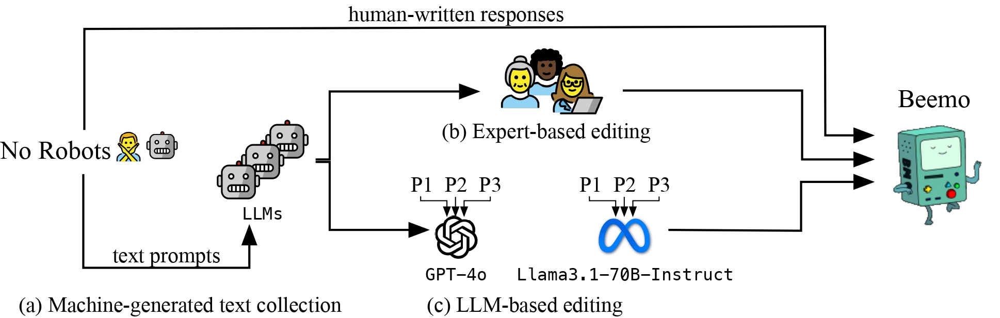

# Beemo


<small> [GIF Source.](https://slackmojis.com/emojis/67173-bmo) </small>

## Dataset Description

Beemo (**B**enchmark of **e**xpert-**e**dited **m**achine-generated **o**utputs) is a benchmark for fine-grained machine-generated text detection, which consists of 6.5k texts written by humans, generated by ten open-source instruction-finetuned LLMs and edited by expert annotators for various use cases. Furthermore, each machine-generated text is edited by two state-of-the-art LLMs using several diverse editing prompts, which results in 13.1k machine-generated & LLM-edited texts. We make one of the first attempts to address more practical machine-generated text detection scenarios, where the user refines the LLM output or utilizes another LLM to make it more human-like.

Beemo is available in the [HuggingFace datasets library](https://huggingface.co/datasets/toloka/beemo) and in this GitHub repository. Please refer to our paper for details on our benchmark creation approach, general statistics, and empirical evaluation results.

<small> Our benchmark is named after BMO (abbreviated from "Be MOre", phonetically spelled "Beemo"), one of the main characters of Adventure Time. </small>

* 📊 **Curated by**: Toloka, Penn State University, MIT Lincoln Laboratory, and University of Oslo.
* 🌐 **Language(s)**: English
* 🗞️ **Paper**: [arxiv.org/abs/2411.04032](https://arxiv.org/abs/2411.04032)
* 🪪 **License**: MIT

### 🔥Updates

* **`04.02.2025`**: Our paper is accepted to NAACL 2025, and we release our [human annotation guidelines](/guidelines).
* **`07.11.2024`**: The release of Beemo, which includes adding machine-generated & LLM-edited texts and a preprint on arXiv.
* **`17.09.2024`**: The initial release and evaluation of 11 detectors on Beemo.

## Benchmark Design



The Beemo's creation approach involves:

* (a) 🤖 **Machine-generated Text Collection**: prompting an instruction-finetuned LLM;
* (b) 👩🏻‍🔬 **Expert-based Editing**: editing the LLM's output by an expert annotator;
* (c) 🦾 **LLM-based Editing**: editing the LLM's output by two state-of-the-art LLMs.


<details>
 <summary><b>🤖 Machine-generated Text Collection</b></summary> 

The [No Robots 🙅‍♂️🤖](https://huggingface.co/datasets/HuggingFaceH4/no_robots) dataset is used as the source of prompts and corresponding human-written texts across the following categories: Generation, Rewrite, Summarize, Open QA, and Closed QA. We randomly sample each prompt to generate an output with one of ten open-source instruction-finetuned LLMs using the default 🤗 HuggingFace chat templates and inference hyperparameters.


| Name |Base | SFT corpus | License | Paper |
|:-------------------------------------|:--------|:-------------------------------------------------------------------|:--------------|:--------------------------------------------------------------|
| [HuggingFaceH4/zephyr-7b-beta](https://huggingface.co/HuggingFaceH4/zephyr-7b-beta) | Mistral-7B-v0.1 | UltraChat, UltradFeedback | MIT | [Tunstall et al. (2023)](https://arxiv.org/abs/2310.16944)  |
| [allenai/tulu-2-7b](https://huggingface.co/allenai/tulu-2-7b)  | Llama 2 7B | human-written and synthetic | AI2 ImpACT | [Ivison et al (2023)](https://arxiv.org/abs/2311.10702) |
| [allenai/tulu-2-13b](https://huggingface.co/allenai/tulu-2-13b)  | Llama 2 13B | human-written and synthetic | AI2 ImpACT | [Ivison et al. (2023)](https://arxiv.org/abs/2311.10702) |
| [google/gemma-2b-it](https://huggingface.co/google/gemma-2b-it)  | Gemma 2B | human-written and synthetic | Gemma license | [Gemma Team et al. (2024)](https://arxiv.org/abs/2403.08295) |
| [google/gemma-7b-it](https://huggingface.co/google/gemma-7b-it) | Gemma 7B | human-written and synthetic | Gemma license | [Gemma Team et al. (2024)](https://arxiv.org/abs/2403.08295) |
| [meta-llama/Llama-2-7b-chat-hf](https://huggingface.co/meta-llama/Llama-2-7b-chat-hf) | Llama 2 7B | Misc.| Llama license | [Touvron et al. (2023)](https://arxiv.org/abs/2307.09288) |
| [meta-llama/Llama-2-13b-chat-hf](https://huggingface.co/meta-llama/Llama-2-13b-chat-hf) | Llama 2 13B | Misc.| Llama license | [Touvron et al. (2023)](https://arxiv.org/abs/2307.09288) |
| [meta-llama/Llama-2-70b-chat-hf](https://huggingface.co/meta-llama/Llama-2-70b-chat-hf) | Llama 2 70B | Misc.| Llama license | [Touvron et al. (2023)](https://arxiv.org/abs/2307.09288) |
| [mistralai/Mistral-7B-Instruct-v0.1](https://huggingface.co/mistralai/Mistral-7B-Instruct-v0.1) | Mistral-7B-v0.1 | Misc. | Apache-2.0 | [Jiang et. al (2023)](https://arxiv.org/abs/2310.06825) |
| [mistralai/Mixtral-8x7B-Instruct-v0.1](https://huggingface.co/mistralai/Mixtral-8x7B-Instruct-v0.1) | Mixtral 8x7B | Misc.| Apache-2.0 | [Jiang et al. (2024)](https://arxiv.org/pdf/2401.04088) |
| [meta-llama/Llama-3.1-70B-Instruct](https://huggingface.co/meta-llama/Llama-3.1-70B-Instruct) | Llama-3.1 | Misc. | Llama | [Dubey et al. (2024)](https://arxiv.org/abs/2407.21783) |
| [GPT-4o](https://openai.com/index/gpt-4o-mini-advancing-cost-efficient-intelligence) | GPT-4 | Misc. | OpenAI | [OpenAI (2024)](https://openai.com/index/gpt-4o-mini-advancing-cost-efficient-intelligence/) |
<medium> Table 1: Overview of the instruction-finetuned LLMs used to create Beemo. ```GPT-4o``` and ```meta-llama/Llama-3.1-70B-Instruct``` are used only for LLM-based editing. </medium>
</details>


<details>
 <summary><b>👩🏻‍🔬 Expert-based Editing</b></summary> 

The machine-generated texts are edited by an in-house team of annotators, who are well experienced in refining content produced by LLMs. 
</details>


<details>
 <summary><b>🦾 LLM-based Editing</b></summary>

 The machine-generated texts are "humanized" by ```GPT-4o``` and ```meta-llama/Llama-3.1-70B-Instruct``` using three editing prompts.

* ```P1```: ```You are given a prompt and a text generated by AI using this prompt. Your task is to edit the AI-generated text to make it sound human-like and error-free. Ensure your overall edits do not exceed 40% of the generated text and the edited text follows the user request. Output only the edited text and do not explain your edits.\n\nPrompt: {prompt}\n\nAI text: {model_output}```
* ```P2```: ```You are given a pair containing two components: (1) a user prompt for an AI assistant and (2) the AI assistant’s response. Refine the AI-generated response to make it sound more natural. Vary your editing patterns and the portions of text you choose to modify, and ensure your overall edits are 20-40% of the words in the response.\n\nUser prompt: {prompt}\n\nAI-generated response: {model_output}```
* ```P3```: ```Modify a machine-generated response to a given prompt to make it appear more like it was written by a native English speaker. Ensure the revised version follows the user's intent. You should just give me the revised version without any other words.\n\nPrompt: {prompt}\n\nMachine-generated response: {model_output}```
</details>

## License

* The prompts and human-written texts from No Robots 🙅‍♂️🤖 are under the original dataset's license: CC-BY-NC-4.0.
* The machine-generated texts and their LLM-edited versions are subject to the underlying instruction-finetuned LLMs' licensing terms mentioned in Table 1.
* The expert-edited machine-generated texts are available under the MIT license, unless otherwise specified in the underlying instruction-finetuned LLMs' licensing terms.

## Cite us

```
@article{artemova2024beemo,
  title={Beemo: Benchmark of Expert-edited Machine-generated Outputs},
  author={Artemova, Ekaterina and Lucas, Jason and Venkatraman, Saranya and Lee, Jooyoung and Tilga, Sergei and Uchendu, Adaku and Mikhailov, Vladislav},
  journal={arXiv preprint arXiv:2411.04032},
  year={2024}
}
```

## Contact us

* Vladislav Mikhailov (vladism@ifi.uio.no)
* Ekaterina Artemova (katya-art@toloka.ai)
